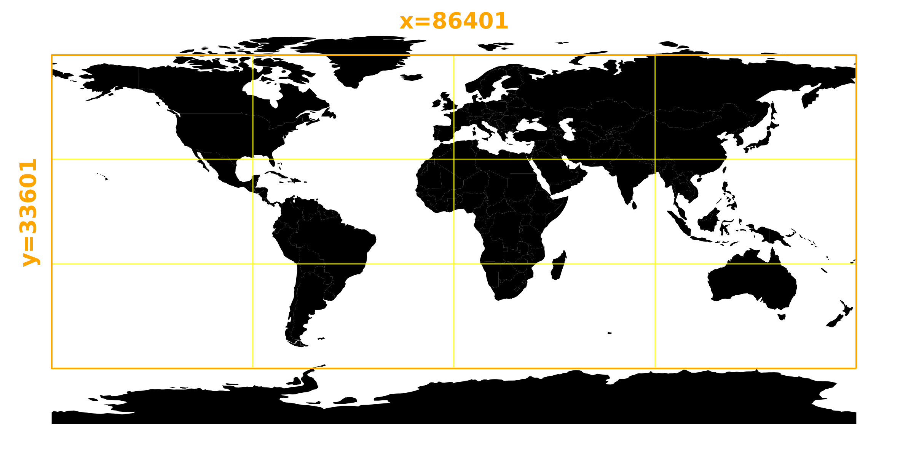
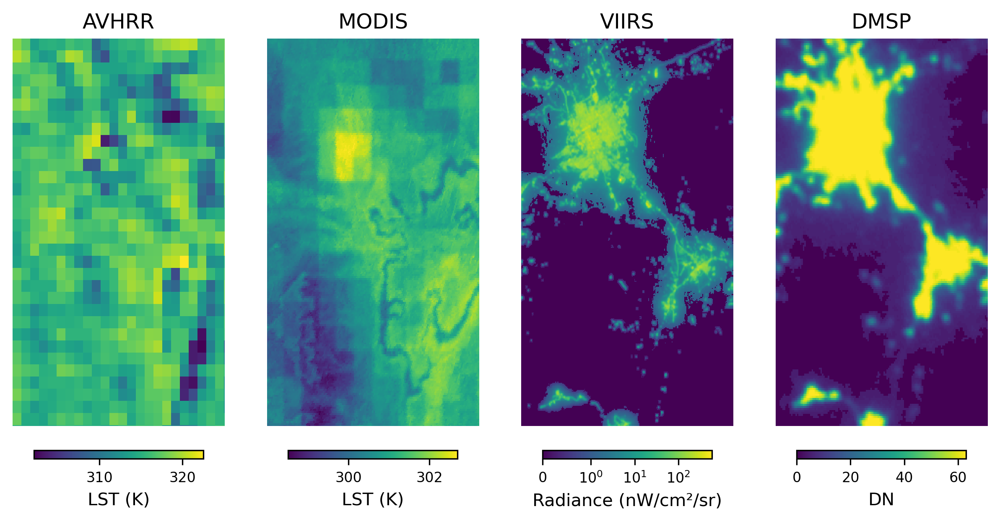
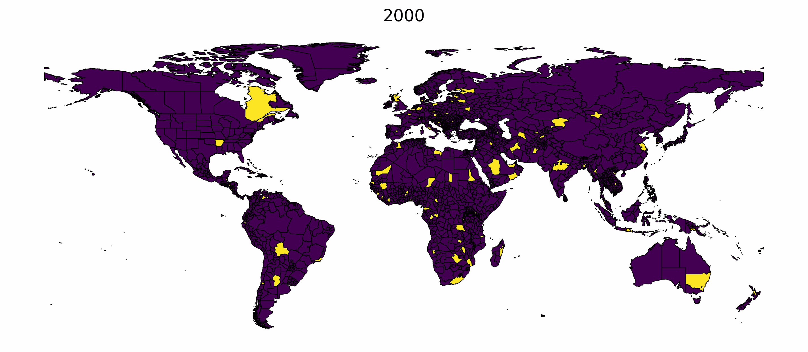
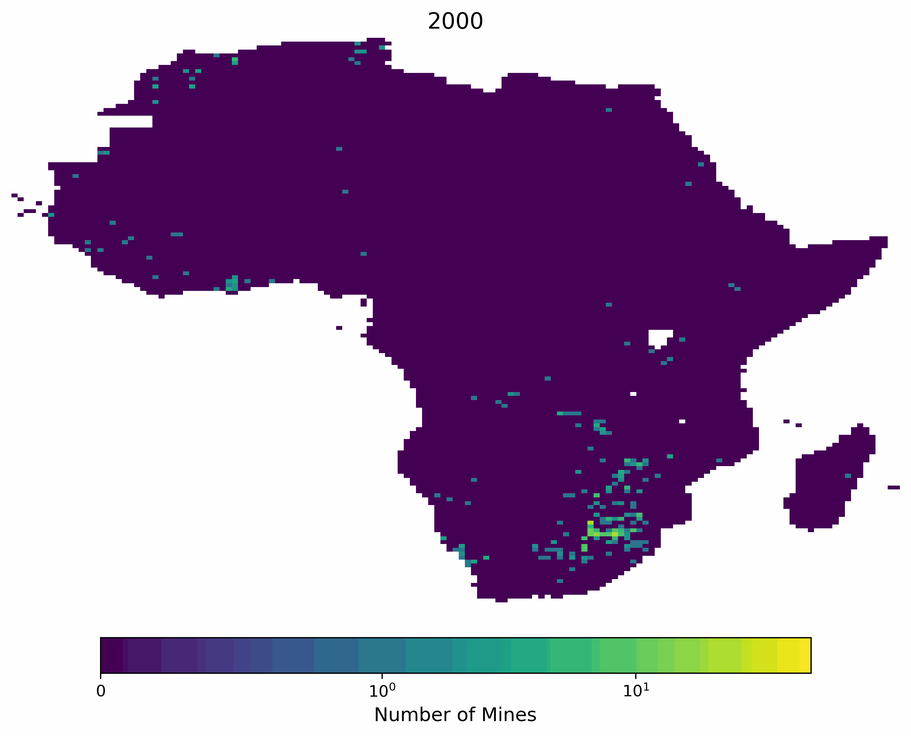
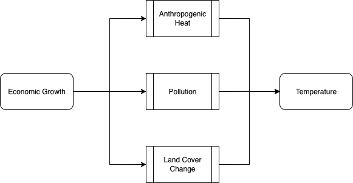

## Economic Growth and Temperature

- Increased economic activity is associated with higher **greenhouse gas emissions**
  - Drives _global_ temperature increases [@ipcc2023; @gillettDetectionAttributionModel2016; @callaghanMachinelearningbasedEvidenceAttribution2021]

Growth also affects _local_ climates:

- **Sealed surfaces** are warmer [@Manoli2019]
- **Pollution** cools down the air [@hansenRadiativeForcingClimate1997]
- **Waste heat** increases air temperature [@Manoli2019]

{.absolute top=250 right=0 height="500"}

## How does economic growth directly and locally impact local temperature changes?

We argue that a key relationship remains insufficiently understood:

> Economic growth has a strong impact on the local environment and influences temperature dynamics

::: {.fragment}

We aim to...

- **Estimate** this relationship between changes in economic output and local temperature changes over time
- Use a **global, annual panel dataset** covering three decades
- Establish **causality** using exogenous variation in economic growth
  - Regional favoritism [@Hodler2014] and resource discoveries [@bermanThisMineMine2017]

:::

## Existing Evidence

- **Urban heat island literature**: cities are warmer than surroundings [@Manoli2019; @Oke2017; @Stewart2012; @Almeida2021; @Kim2021a]
  - **Economic growth** as fundamental driver overlooked
  - Focus exclusively on **urban–rural temperature differentials**
    - Ignores heating from rural landscape transformations
  - Study a few hundred cities within specific climate zones at a maximum
    - Lack **global coverage**
  - Rely **cross-sectional data** of urban limits
    - Cannot capture the **temporal dynamics of changing environments**

## Data {#data}

The effects we seek to capture occur at levels finer than municipal districts

- Classical economic data is not globally available at this resolution
- We therefore leverage gridded, remote sensing data

We assemble a **pixel-by-pixel panel dataset** with global coverage

- **Economic data**: Night Time Lights (NTL) from the DMSP and VIIRS sensors [@Henderson2012; @Gibson2021; @elvidge1997mapping; @liStepwiseCalibrationGlobal2017; @Roman2018] [Validity of Proxy](#proxy-validity){.btn .btn--minimal role="button"}
- **Temperature data**: MODIS and AVHRR Land Surface Temperature (LST) products from GLASS suite [@Zhou2019; @Liang2021]

## Data (cont.)

The data is extremely detailed and **large-scale**

- **Spatial resolution**: 500m (1km before 2013, 5km before 2000)
- **Temporal resolution**: Annual, 1992-2022

The resulting dataset contains over **17 billion observations**

{.nostretch #fig-data-coverage fig-align="center" width="60%"}

## Data (cont.) {#data-examples}

{.nostretch #fig-data-quality fig-align="center" width="100%"}

::: {.text-end}
​[Validity of Night Light Data](#proxy-validity){.btn .btn--minimal role="button"}
:::

## Regression Model

We seek to estimate the linear relationship between economic growth and temperature changes

$$
T_{i,t} = \beta_0 + \beta_1 {NL}_{i,t} + \gamma_i + \delta_t + \epsilon_{i,t}
$$

where $T_{i,t}$ is the land surface temperature, ${NL}_{i,t}$, is the night light intensity, $\gamma_i$ are pixel fixed effects, $\delta_t$ are year fixed effects, $i$ indexes map pixels and $t$ indexes years.

## Estimation {#estimation}

The size of the dataset poses **computational challenges**

- Even on the most powerful machines, standard regression techniques are **infeasible**
  - Computation of key statistics (e.g., $X'X$ and within transformation) require more memory than available

::: {.fragment}

- We extend the **compressed regression algorithm** [@wongYouOnlyCompress2021]
  - We round $X$ at the fifth decimal and then compress it by grouping identical rows with mean outcomes
    - This can be done efficiently with modern SQL systems like DuckDB
  - We further compute and aggregate **sufficient statistics** for parameters and standard errors in SQL
  - Fixed effects are efficiently included using Mundlak devices [@arkhangelskyFixedEffectsGeneralized2024]

:::

## Estimation {#estimation-2}

- **Compressed OLS** is the first fully scalable algorithm for regression
- Allows estimation with **billions of observations** and **millions of fixed effects** on a single machine with limited memory
  - Applications?
- Software is available on [GitHub](https://github.com/felixschulz385/growth-and-temperature)

## Results: Baseline TWFE OLS

::: {#tbl-baseline}



Baseline OLS results

:::

## Economic Research on the Impacts of Temperature

- Increases in temperature have been shown to **reduce economic output**  [@Dell2012; @Dell2009]
- **Channels** include _labor productivity_, _mortality_, _birth outcomes_, _education outcomes_ and _agricultural yields_  [@Dell2014; @Somanathan2021; @Carleton2022; @Deschenes2009b; @Park2020; @Garg2020]
- The impacts are **highly unequal** across regions and income levels  [@diffenbaughGlobalWarmingHas2019]
- **Adaptation** (in behavior and through technology) helps mitigate some of the effects [@Carleton2022; @Barreca2016; @He2023; @Heutel2021]
  
## Establishing Causality

We leverage exogenous shocks to economic growth

- **Regional favoritism**: Some regions receive disproportionate government investment [@Hodler2014; @bomprezziWeddedProsperitySpousal2025]
- **Mine openings**: Sudden discoveries of natural resources can lead to economic booms [@Arezki2017; @Cust2015; @Gollin2016; @bermanThisMineMine2017]

::: {.columns}

:::: {.column width="60%"}
{width=100% #fig-favoritism}
::::

:::: {.column width="35%"}
{width=100% #fig-mining}
::::

:::

## Future Extension: Heterogeneity

Growth-induced temperature effects likely differ across regions

- Growth forms vary by context, shaping local environmental impacts
- **Income**: Growth in poorer regions may be associated with higher pollution
- **Institutions**: Stronger institutions may internalize temperature impacts
- **Geography**: Effects may differ by climate zone or coastal proximity

## Future Extension: Channels

With additional data, we plan to explore specific channels through which economic growth affects local temperatures

- **Land cover changes**: Growth-induced sealing of land surfaces alters surface energy balance [@Manoli2019]
- **Air pollution**: Increased emissions influence radiative forcing [@hansenRadiativeForcingClimate1997]
- **Direct heat emissions**: Waste heat from industrial and residential activities [@Manoli2019]

{.nostretch #fig-channels fig-align="center" width="40%"}

## Conclusion

We study the **direct impact of economic growth on local temperature changes**

### Current progress
  - Assembled a novel, global pixel-level panel dataset
  - Implemented a **scalable regression algorithm** to handle our large dataset
  - Estimated first correlational evidence

### Next steps
  - Evaluate **causal effects** using exogenous variation in economic growth
  - Investigate **heterogeneity** across regions
  - Explore specific **channels** through which growth affects temperature

## References

::: {#refs}
:::

### Images
- Title slide: AP Photo/Andres Kudacki
- Economic Growth and Temperature: Eliud Gil Samaniego/The Guardian
- Melting Pots: Wallace Woon/EPA-EFE/Shutterstock; Victor on Unsplash; DUIC

# Appendix

## Proxying Economic Activity with Nighttime Lights {#proxy-validity}

- Before 2013, DMSP-OLS data was the only global nighttime lights source
  - @Henderson2012 establish the existence of a positive but imperfect elasticity with GDP
  - @Gibson2021 summarize the remote sensing literature on measuring error and bias in NTL data
    - **Blurring (Blooming)**: Light is misattributed to surrounding areas due to coarse resolution (~2.7 km), sensor design, and geolocation errors, inflating urban extents by up to 500%
    - **Top-Coding**: Bright urban pixels are capped at DN 63, eliminating variation in city cores and preventing accurate intra-urban analysis
    - **No Calibration**^[We use the corrected and inter-calibrated dataset from @liStepwiseCalibrationGlobal2017]: Unrecorded sensor gain changes and inter-satellite inconsistencies make time-series comparisons unreliable

::: {.text-end}
[Data](#data){.btn .btn--minimal role="button"}
​[Data Examples](#data-examples){.btn .btn--minimal role="button"}
:::

## Proxying Economic Activity with Nighttime Lights (contd.) 

- Before 2013, DMSP-OLS data was the only global nighttime lights source
  - According to @Gibson2021, the consequences of significant measurement error in the data include:
    - Rural Underdetection: Dim rural lighting is often invisible, leading to zero-light readings in populated areas.
    - Inequality Underestimation: Spatial inequality is significantly understated, especially in cities
- Since 2013, VIIRS data offer higher resolution, radiometric calibration, and greater dynamic range, making them a far more reliable alternative for economic and urban analysis

::: {.text-end}
​[Return](#data){.btn .btn--minimal role="button"}
:::

## Strategy {#estimation-strategy}

- Maintain and aggregate **sufficient statistics** $X^\top X$, $X^\top y$, counts, and residual-based cluster scores across partitions; estimate $\hat\beta = (X^\top X)^{-1}X^\top y$ once the sufficient stats are combined
- Report **classical OLS uncertainty** via the sandwich "bread" $(X^\top X)^{-1}$ and homoskedastic "meat" $\hat\sigma^2 I$ to obtain $\widehat{\mathrm{Var}}(\hat{\beta})=\hat{\sigma}^2 (X^\top X)^{-1}$ when no clustering is requested
- Enable **cluster-robust inference** by replacing the meat with cluster-aggregated score outer products, yielding a consistent sandwich estimator under within-cluster correlation and heteroskedasticity

## Core algebra

- Normal equations: minimize $\|y-X\beta\|^2$ to solve $(X^\top X)\hat\beta = X^\top y$ and hence $\hat\beta = (X^\top X)^{-1}X^\top y$ using only $X^\top X$ and $X^\top y$ **accumulated online**
- One-way cluster-robust “sandwich”:  
  $$ \widehat{\mathrm{Var}}(\hat\beta)=(X^\top X)^{-1}\Big(\sum_{g} X_g^\top \hat u_g \hat u_g^\top X_g \Big)(X^\top X)^{-1},\quad \hat u = y - X\hat\beta, $$ 
  which is the standard cluster-robust covariance for OLS
- **Finite-sample adjustments**: commonly multiply clusterwise residuals by factors like $\frac{G}{G-1}\cdot\frac{N-1}{N-K}$ (Stata-style) or apply HC1’s $\frac{N}{N-K}$ degrees-of-freedom correction to improve small-sample behavior

## Two-way clustering and reporting

- **Two-way clustered covariance** is obtained by inclusion–exclusion: compute one-way covariances on cluster 1 and cluster 2, then subtract the intersection covariance, i.e., $V_{\text{2-way}}=V_1+V_2 - V_{12}$
- Practical guidance: cluster-robust methods assume **many independent clusters**; with few or unbalanced clusters, inference can be unreliable and may need small-sample corrections or alternative procedures
- The approach aligns with the @cameronRobustInferenceMultiway2011a framework for multi-way clustering and the broader practitioner guidance on cluster-robust inference implemented in common software
  
::: {.text-end}
​[Return](#estimation){.btn .btn--minimal role="button"}
:::

## Existing Evidence

Geophysical **Global Climate Models** simulate key mechanisms [@ipcc2023; @bellouinBoundingGlobalAerosol2020; @mahmoodLandCoverChanges2014]

- **Ideal Fingerprinting** techniques quantify contributions of land use changes and aerosols
- Small observational literature bounds from global residuals
- **Economic growth** as fundamental driver overlooked
- Lack **spatial resolution** to capture local effects

## Results: Preliminary First Stage Estimates

 

::: {#tbl-iv}



First stage regression results

:::

## Melting Pots

- **Urban areas** consistently experience higher temperatures than their surrounding rural regions, a phenomenon known as the urban heat island effect [@Manoli2019; @Stevens2024]

- **Adaptation measures** are being implemented worldwide to mitigate urban heat [@Soliman2024; @chrismichaelCitiesAreTackling2024; @Robles2023]

::: {.columns}

:::: {.column width="12.5%"}

::::

:::: {.column width="25%"}
{width=350}
::::

:::: {.column width="25%"}
{width=350}
::::

:::: {.column width="25%"}
{width=350}
::::

:::